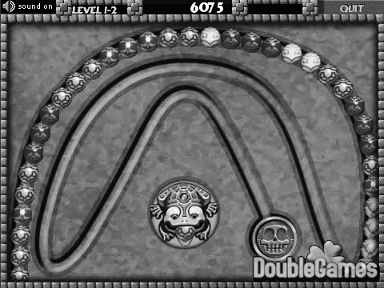
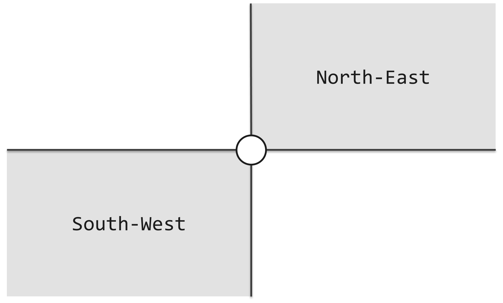
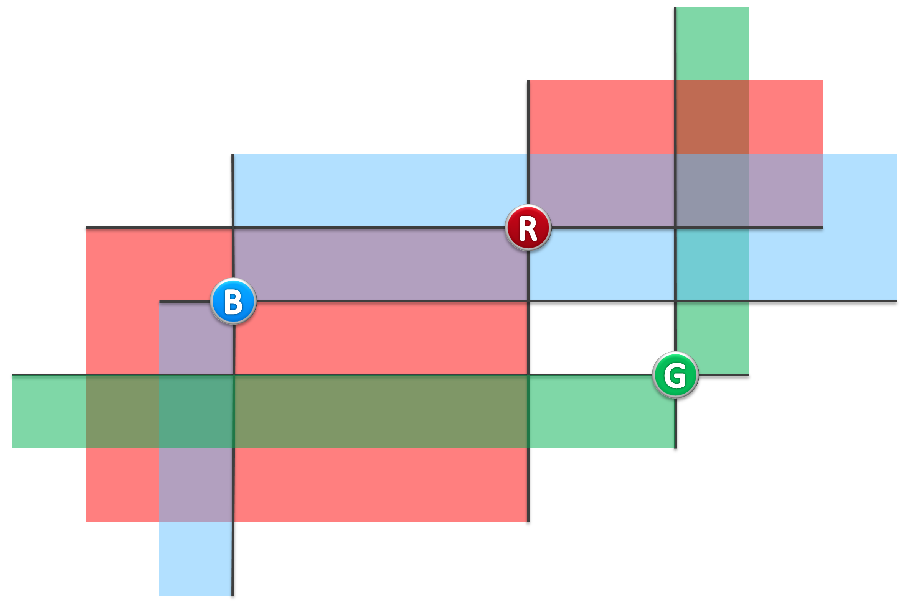
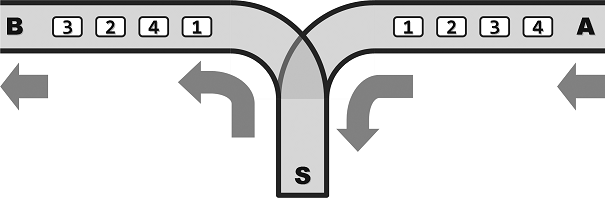
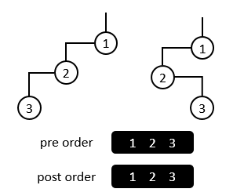
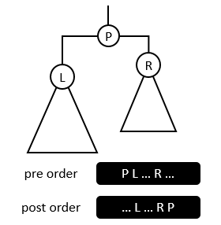

# Tsinghua-Online-Judge-MOOC
[OJ地址](https://dsa.cs.tsinghua.edu.cn/oj)
## Range
### Descriptioin  
Let S be a set of n integral points on the x-axis. For each given interval [a, b], you are asked to count the points lying inside.

*Input*

The first line contains two integers: n (size of S) and m (the number of queries).

The second line enumerates all the n points in S.

Each of the following m lines consists of two integers a and b and defines an query interval [a, b].

*Output*

The number of points in S lying inside each of the m query intervals.

**Example**

*Input*

5 2

1 3 7 9 11

4 6

7 12

*Output*

0

3

**Restrictions**

0 <= n, m <= 5 * 10^5

For each query interval [a, b], it is guaranteed that a <= b.

Points in S are distinct from each other.

Coordinates of each point as well as the query interval boundaries a and b are non-negative integers not greater than 10^7.

Time: 2 sec

Memory: 256 MB

## Zuma

### Description

Let's play the game Zuma!

There are a sequence of beads on a track at the right beginning. All the beads are colored but no three adjacent ones are allowed to be with a same color. You can then insert beads one by one into the sequence. Once three (or more) beads with a same color become adjacent due to an insertion, they will vanish immediately.

Note that it is possible for such a case to happen for more than once for a single insertion. You can't insert the next bead until all the eliminations have been done.

Given both the initial sequence and the insertion series, you are now asked by the fans to provide a playback tool for replaying their games. In other words, the sequence of beads after all possible eliminations as a result of each insertion should be calculated.

*Input*

The first line gives the initial bead sequence. Namely, it is a string of capital letters from 'A' to 'Z', where different letters correspond to beads with different colors.

The second line just consists of a single interger n, i.e., the number of insertions.

The following n lines tell all the insertions in turn. Each contains an integer k and a capital letter Σ, giving the rank and the color of the next bead to be inserted respectively. Specifically, k ranges from 0 to m when there are currently m beads on the track.

*Output*
n lines of capital letters, i.e., the evolutionary history of the bead sequence.

Specially, "-" stands for an empty sequence.

**Example**

*Input*

ACCBA

5

1 B

0 A

2 B

4 C

0 A

*Output*

ABCCBA

AABCCBA

AABBCCBA

_

A

**Restrictions**

0 <= n <= 10^4

0 <= length of the initial sequence <= 10^4

Time: 2 sec

Memory: 256 MB

## LightHouse

### Description

As shown in the following figure, If another lighthouse is in gray area, they can beacon each other.

For example, in following figure, (B, R) is a pair of lighthouse which can beacon each other, while (B, G), (R, G) are NOT.

*Input*

1st line: N

2nd ~ (N + 1)th line: each line is X Y, means a lighthouse is on the point (X, Y).

*Output*

How many pairs of lighthourses can beacon each other

( For every lighthouses, X coordinates won't be the same , Y coordinates won't be the same )

**Example**

*Input*

3

2 2

4 3

5 1

*Output*

1

**Restrictions**

For 90% test cases: 1 <= n <= 3 * 105

For 95% test cases: 1 <= n <= 106

For all test cases: 1 <= n <= 4 * 106

For every lighthouses, X coordinates won't be the same , Y coordinates won't be the same.

1 <= x, y <= 10^8

Time: 2 sec

Memory: 256 MB

**Hints**

The range of int is usually [-231, 231 - 1], it may be too small.

## Train
### Description
Figure 1 shows the structure of a station for train dispatching.

Figure 1

In this station, A is the entrance for each train and B is the exit. S is the transfer end. All single tracks are one-way, which means that the train can enter the station from A to S, and pull out from S to B. Note that the overtaking is not allowed. Because the compartments can reside in S, the order that they pull out at B may differ from that they enter at A. However, because of the limited capacity of S, no more that m compartments can reside at S simultaneously.

Assume that a train consist of n compartments labeled {1, 2, …, n}. A dispatcher wants to know whether these compartments can pull out at B in the order of {a1, a2, …, an} (a sequence). If can, in what order he should operate it?

*Input*

Two lines:

1st line: two integers n and m;

2nd line: n integers separated by spaces, which is a permutation of {1, 2, …, n}. This is a compartment sequence that is to be judged regarding the feasibility.

*Output*

If the sequence is feasible, output the sequence. “Push” means one compartment goes from A to S, while “pop” means one compartment goes from S to B. Each operation takes up one line.

If the sequence is infeasible, output a “no”.

**Example 1**

*Input*

5 2

1 2 3 5 4

*Output*

push

pop

push

pop

push

pop

push

push

pop

pop

**Example 2**

*Input*

5 5

3 1 2 4 5

*Output*

No

**Restrictions**

1 <= n <= 1,600,000

0 <= m <= 1,600,000

Time: 2 sec

Memory: 256 MB

## Proper Rebuild
### Description

In general, given the preorder traversal sequence and postorder traversal sequence of a binary tree, we cannot determine the binary tree.

Figure 1

In Figure 1 for example, although they are two different binary tree, their preorder traversal sequence and postorder traversal sequence are both of the same.

But for one proper binary tree, in which each internal node has two sons, we can uniquely determine it through its given preorder traversal sequence and postorder traversal sequence. 

Label n nodes in one binary tree using the integers in [1, n], we would like to output the inorder traversal sequence of a binary tree through its preorder and postorder traversal sequence. 

*Input*

The 1st line is an integer n, i.e., the number of nodes in one given binary tree,

The 2nd and 3rd lines are the given preorder and postorder traversal sequence respectively.

*Output*

The inorder traversal sequence of the given binary tree in one line.

**Example**

*Input*

5

1 2 4 5 3

4 5 2 3 1

*Output*

4 2 5 1 3

**Restrictions**

For 95% of the estimation, 1 <= n <= 1,000,00

For 100% of the estimation, 1 <= n <= 4,000,000

The input sequence is a permutation of {1,2...n}, corresponding to a legal binary tree.

Time: 2 sec

Memory: 256 MB

**Hints**

Figure 2

In Figure 2, observe the positions of the left and right children in preorder and postorder traversal sequence

## TSP

### Description

Shrek is a postman working in the mountain, whose routine work is sending mail to n villages. Unfortunately, road between villages is out of repair for long time, such that some road is one-way road. There are even some villages that can’t be reached from any other village. In such a case, we only hope as many villages can receive mails as possible.

Shrek hopes to choose a village A as starting point (He will be air-dropped to this location), then pass by as many villages as possible. Finally, Shrek will arrived at village B. In the travelling process, each villages is only passed by once. You should help Shrek to design the travel route.

*Input*

There are 2 integers, n and m, in first line. Stand for number of village and number of road respectively.

In the following m line, m road is given by identity of villages on two terminals. From v1 to v2. The identity of village is in range [1, n].

*Output*

Output maximum number of villages Shrek can pass by.

**Example**

*Input*

4 3

1 4

2 4

4 3

*Output*
3

**Restrictions**

1 <= n <= 1,000,000

0 <= m <= 1,000,000

These is no loop road in the input.

Time: 2 sec

Memory: 256 MB

**Hints**

Topological sorting

## Broadcast
### Description
A broadcaster wants to set up a radio broadcast transmitter in an area. There are n towns in the area, and each town has a transmitter installed and plays its own program.

However, the company only licensed the two bands FM104.2 and FM98.6, and transmitters using the same band would interfere with each other. It is known that the signal coverage of each transmitter is a circular area with a radius of 20km. Therefore, if two towns with a distance of less than 20km use the same band, they will not be able to function properly due to band interference. Listen to the show. Now give a list of towns with distances less than 20km, and try to determine whether the company can make residents of the entire region hear the broadcasts normally.

*Input*

The first line is two integers n, m, which are the number of towns and the number of town pairs that are less than 20km. The next m lines, 2 integers per line, indicate that the distance between the two towns is less than 20km (numbering starts at 1).

*Output*

Output 1 if the requirement is met, otherwise -1.

*Input sample*

4 3

1 2

1 3

2 4

*Output sample*

1

**Restrictions**

1 ≤ n ≤ 10000

1 ≤ m ≤ 30000

There is no need to consider the spatial characteristics of a given 20km town list, such as whether triangle inequality is satisfied, whether more information can be derived using transitivity, and so on.

Time: 2 sec

Space: 256MB

**Tips**

BFS

## Deduplicate
### Description
Mr. Epicure is compiling an encyclopedia of food. He had collected a long list of candidates nominated by several belly-gods. As candidates in list are nominated by several people, duplication of name is inevitable. Mr. Epicure pay you a visit for help. He request you to remove all duplication, which is thought an easy task for you. So please hold this opportunity to be famous to all belly-gods.

*Input*

1 integer in fist line to denote the length of nomination list. In following n lines, each nomination is given in each line.

*Output*

All the duplicated nomination (only output once if duplication appears more multiple times), which is sorted in the order that duplication appears firstly.

**Example**

*Input*

10

brioche

camembert

cappelletti

savarin

cheddar

cappelletti

tortellni

croissant

brioche

mapotoufu

*Output*

cappelletti

brioche

**Restrictions**

1 < n < 6 * 10^5

All nominations are only in lowercase. No other character is included. Length of each item is not greater than 40.

Time: 2 sec

Memory: 256 MB

**Hints**

Hash
